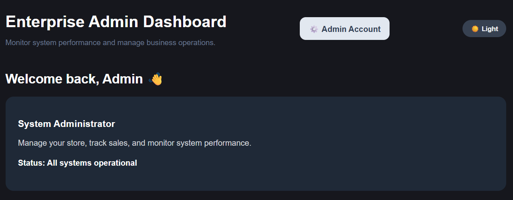
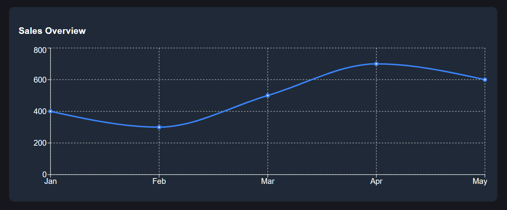
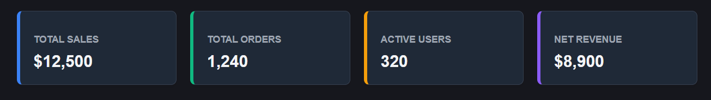
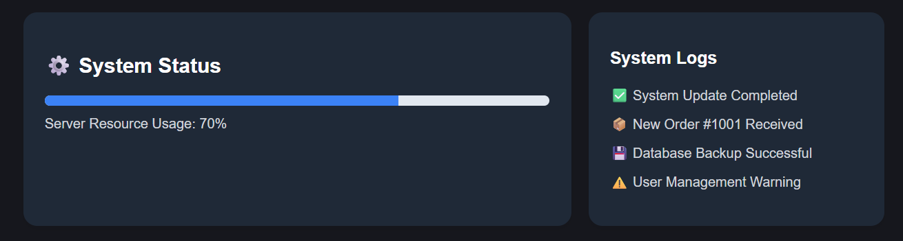
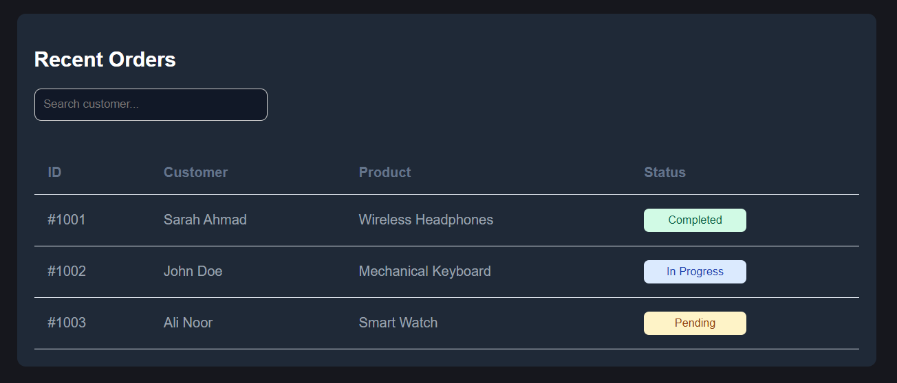

# Enterprise Admin Dashboard

A modern and responsive admin dashboard built with React. The project demonstrates component-based architecture, reusable UI components, state management, dark mode functionality, dynamic data rendering, and a clean user interface suitable for business management systems.

## Links

- 🚀 Live Demo: https://ayaalsaudi6-blip.github.io/Dashboard-React/
- 💻 Source Code: https://github.com/ayaalsaudi6-blip/Dashboard-React

## Features

- Responsive Dashboard Layout
- Reusable React Components
- Dynamic Statistics Cards
- Dark Mode Toggle
- Search Functionality for Orders
- Recent Activities Section
- Orders Management Table
- Modern Sidebar Navigation
- Clean and Professional UI Design

## Preview

